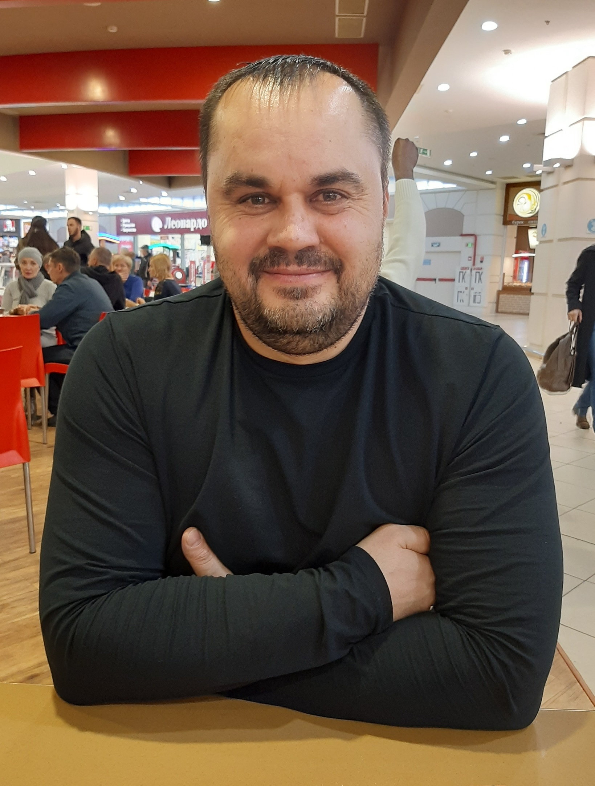

# Evgeny Zakharov
### **Profession:** Frontend Developer Course<br>**Status:** Student
___
## **Contacts for communication**
+ *Location: Tolyatti, Russia*
+ *Discord RSSchool: Evgeny Zakharov(@EZ50)*
+ *Phone: [+79053069055](+79053069055)*
+ *E-mail: [evzakharov71@gmail.com](evzakharov71@gmail.com)*
+ *GitHab: [EZ50](https://github.com/EZ50)*
+ *Telegram: [Evgeny Zakharov](https://t.me/ZakharYevgenyevich)*
___
## **About My**
### Before learning programming, I studied web design. The writing of the code liked its dynamics and accuracy,<br> new knowledge, the opportunity to see the result of their work in the present tense.<br> My task is to learn the profession of a developer
___
## **Skills**
+ HTML
+ CSS
+ Figma
+ Webflow
+ GIT
+ VS Code
___
## **Example code**
```javascript
const firstLine = 'RS School is free-of-charge and community-based education';
const secondLine  = 'program conducted by The Rolling Scopes developer community';
const thirdLine = 'since 2013';
console.log(`${firstLine}\n${secondLine}\n${thirdLine}`);
```
___
## **Work experience**
### Not at the moment
___
